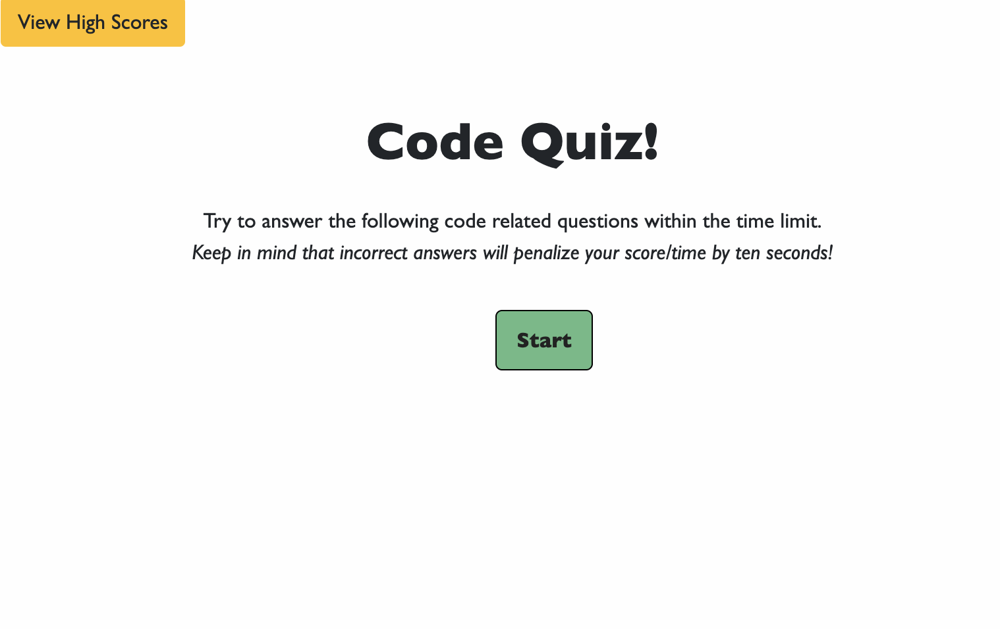

## Code-Quiz

This code-quiz is a simple quiz that uses JavaScript to display questions and store responses that results in an overall quiz score. 

## Technology Used

* Javascript
* HTML
* CSS
* Bootstrap

## Preview

  

<a href= "https://gnorzea.github.io/Code-Quiz/"> Deployed Link on GitHub</a>